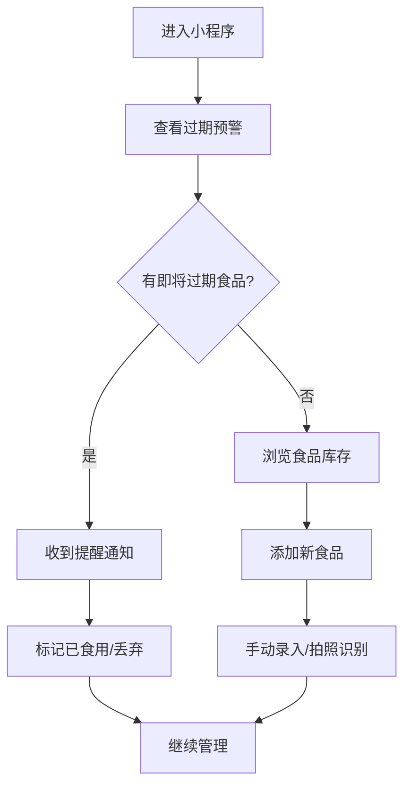

## 1. Product Overview
【再不吃就坏了】是一款帮助用户管理食品保质期的生活服务类小程序，旨在提醒用户及时食用即将过期的食物，减少食物浪费，倡导健康生活方式。

- **主要目的**: 帮助用户追踪食品保质期，提供智能提醒服务
- **解决问题**: 食物过期浪费、忘记食用库存食品
- **目标用户**: 注重生活品质、关注健康饮食的年轻消费者
- **市场价值**: 响应国家"反食品浪费"号召，帮助用户养成良好的生活习惯

## 2. Core Features

### 2.1 User Roles
| Role | Registration Method | Core Permissions |
|------|---------------------|------------------|
| 用户 | 微信授权登录 | 使用所有功能 |

### 2.2 Feature Module
1. **首页**: 展示即将过期的食品列表、智能提醒
2. **添加食品页**: 手动添加食品信息、拍照识别
3. **食品管理页**: 查看所有食品库存、分类管理
4. **背景故事页**: 介绍小程序创作背景和理念

### 2.3 Page Details
| Page Name | Module Name | Feature description |
|-----------|-------------|---------------------|
| 首页 | 过期预警 | 展示3天内即将过期的食品，按过期时间排序 |
| 首页 | 智能提醒 | 根据用户习惯推送食用建议 |
| 添加食品页 | 手动录入 | 输入食品名称、保质期、购买日期 |
| 添加食品页 | 拍照识别 | 识别食品包装上的生产日期和保质期 |
| 食品管理页 | 分类管理 | 按类别（冷藏、冷冻、干货等）筛选 |
| 背景故事页 | 故事介绍 | 讲述创作灵感和背后的故事 |

## 3. Core Process
用户进入小程序 -> 查看即将过期食品提醒 -> 添加新食品 -> 接收过期提醒 -> 标记已食用

## 4. User Interface Design

### 4.1 Design Style
- **主色调**: 清新绿色系（#22c55e），象征健康、新鲜
- **辅助色**: 温暖橙色（#f97316）用于提醒和重点内容
- **按钮风格**: 圆润圆角、渐变效果、悬停动画
- **字体**: 思源黑体，现代简洁
- **布局风格**: 卡片式布局、清新简约
- **图标风格**: 线条简洁、色彩明快

### 4.2 Page Design Overview
| Page Name | Module Name | UI Elements |
|-----------|-------------|-------------|
| 首页 | Hero区域 | 渐变背景、醒目标题、主按钮 |
| 首页 | 功能介绍 | 图标+文字说明、动画效果 |
| 首页 | 背景故事 | 图文结合、故事叙述 |
| 首页 | 使用流程 | 步骤卡片、箭头引导 |

### 4.3 Responsiveness
- 移动端优先设计
- 响应式布局适配不同屏幕尺寸
- 触摸友好的交互设计

### 4.4 Visual Effects
- 渐入动画效果
- 卡片悬停效果
- 平滑滚动体验
- 微交互动画