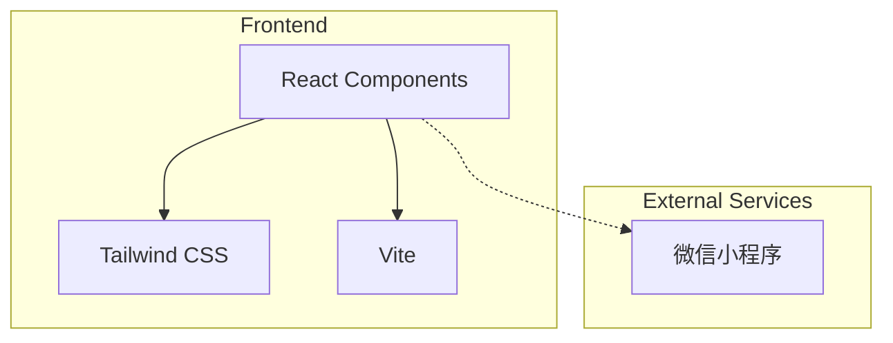

## 1. Architecture Design


## 2. Technology Description
- **Frontend**: React@18 + TypeScript + TailwindCSS@3
- **Build Tool**: Vite@6
- **Icons**: Lucide React
- **Backend**: None (展示页纯前端)
- **Hosting**: 静态网页托管

## 3. Route Definitions
| Route | Purpose |
|-------|---------|
| / | 首页 - 小程序介绍和功能展示 |

## 4. Page Structure
```
src/
├── components/
│   ├── Hero.tsx          # 首页Hero区域
│   ├── Features.tsx      # 功能介绍模块
│   ├── Story.tsx         # 背景故事模块
│   ├── HowItWorks.tsx    # 使用流程模块
│   └── Footer.tsx        # 页脚
├── App.tsx               # 主应用组件
├── main.tsx              # 入口文件
└── index.css             # 全局样式
```

## 5. Component Details

### 5.1 Hero Component
- **功能**: 展示小程序名称和核心价值主张
- **元素**: 标题、副标题、描述文字、下载引导

### 5.2 Features Component
- **功能**: 介绍小程序核心功能
- **元素**: 功能卡片、图标、功能描述

### 5.3 Story Component
- **功能**: 讲述创作背景故事
- **元素**: 故事文本、配图

### 5.4 HowItWorks Component
- **功能**: 展示使用流程
- **元素**: 步骤卡片、箭头指示

### 5.5 Footer Component
- **功能**: 页脚信息
- **元素**: 版权信息、链接

## 6. Styling Guidelines
- 使用TailwindCSS进行样式管理
- 主色调: #22c55e (清新绿色)
- 辅助色: #f97316 (温暖橙色)
- 文字颜色: #1f2937 (深色)、#6b7280 (浅色)
- 背景色: #fafafa (浅灰)

## 7. Performance Considerations
- 使用React懒加载优化首屏加载
- 图片压缩优化
- CSS动画使用GPU加速

## 8. Responsive Design
- 移动端优先设计
- 断点: sm(640px), md(768px), lg(1024px), xl(1280px)
- 使用Tailwind响应式工具类